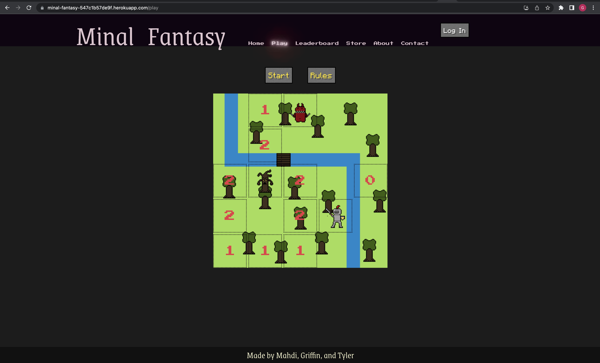

# Minal-Fantasy

## Description

- We decided to make a new twitst on some old classic games.

- Minesweeper except when you click the mine, its actually a monster and play an entire rpg around this concept.

- a full stack application (Express, React, Grapghql, etc.)

- React, Hook, Components, Express, Grapghql, software design and architecture, async/await, and more

## Table of Contents

- [How To Use](#how-to-use)
- [Installation](#installation)
- [Credits](#credits)
- [License](#license)
- [Helpful Resources](#helpful-resources)
- [How to Contribute](#how-to-contribute)

## How To Use

When you visit our site, you can login in the top right hand corner. If you do not have an account you can make a new one in this area. After you are logged in, you will be able to play the game by clicking the play button and then the start button on the game page.

Deployed URL: https://minal-fantasy-547c1b57de9f.herokuapp.com/



Github Repo: https://github.com/miladesmailpour/minal-fantasy.git

## Installation

```
npm install
npm run develop

```

## Credits

- [Tyler Vick](https://github.com/jrtvick/jrtvick/)
- [Milad Esmailpour](https://github.com/miladesmailpour/)
- [Griffin Pelletier ](https://github.com/Sunderfire/)

## License

MIT LICENSE

## Helpful Resources

[Use the Production Build](https://legacy.reactjs.org/docs/optimizing-performance.html#use-the-production-build)

## How to Contribute

Challenges repository
This is an open-source project Licensed by MIT which allows you to contribute and used open source codes used in this repo (All Branches).
More info: https://g.co/kgs/QWcHhF

- Branches are named as modules [n] and each is a unique challenge.
- Master Branch contains the last solved challenge. (the read me you are reading through, is a default guide when NO challenge is available to help you do a pre-setup.)

# How to use the module and deploy

- Clone the repo and make it own

  # Https URL :

        git clone https://github.com/miladesmailpour/minal-fantasy.git

  # ssh URL :

        git clone git@github.com:miladesmailpour/minal-fantasy.git

  # Checking the fetch/pull and push URL :

        git remote -v

  # Modifing origin URL :

        git remote add origin [https/ssh URL of your repo] https://docs.github.com/en/get-started/quickstart/create-a-repo

  # Verifing the fetch/pull and push URL :

        git remote -v https://docs.github.com/en/get-started/getting-started-with-git/managing-remote-repositories

  # Chacking the status of local :

        git status

        "if local NOT updated"
        git add .
        git commit -m "[your comment]"
        git push origin master/main

- Checkout the module (the challenge you want to use and deploy)
  # Checkout to the desired challenge :
       git checkout module[n]
  # Verifing :
       git status
  # [Make the change you wish to have]
       What do you think needs to improve?
  # Commiting to local and updating the GitHub repo:
         git add .
         git commit -m "[your comment]"
         git push origin [your module name]
- Moving Modules to Master Branch and deploying:
  # Creating a pull request to update the master/main :
       https://docs.github.com/en/pull-requests/collaborating-with-pull-requests/proposing-changes-to-your-work-with-pull-requests/creating-a-pull-request
  # Deploy through the GitHub :
       https://docs.github.com/en/pages/getting-started-with-github-pages/configuring-a-publishing-source-for-your-github-pages-site
